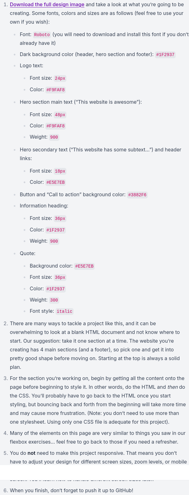

# Project-Landing-Page
This task is to remake this html landing page.

## Specification

## Attribution
[Wikiwater2020](https://commons.wikimedia.org/wiki/File:Seoul_Blue_Bus.jpg), [CC BY-SA 3.0](https://creativecommons.org/licenses/by-sa/3.0), via Wikimedia Commons
[Tarun.real](https://commons.wikimedia.org/wiki/File:Strawberries_for_sale_at_Mahabaleshwar.jpg), [CC BY-SA 4.0](https://creativecommons.org/licenses/by-sa/3.0), via Wikimedia Commons
[Shamim Munshi](https://commons.wikimedia.org/wiki/File:Beautiful_grass.jpg), [CC BY-SA 4.0](https://creativecommons.org/licenses/by-sa/3.0), via Wikimedia Commons
[Smuconlaw](https://commons.wikimedia.org/wiki/File:Fish_in_the_S.E.A._Aquarium,_Marine_Life_Park,_Resorts_World_Sentosa,_Singapore_-_20130105-05.JPG), [CC BY-SA 3.0](https://creativecommons.org/licenses/by-sa/3.0), via Wikimedia Commons
[Armandeo64](https://commons.wikimedia.org/wiki/File:Goblin_by_armandeo64.jpg), [CC BY-SA 4.0](https://creativecommons.org/licenses/by-sa/3.0), via Wikimedia Commons